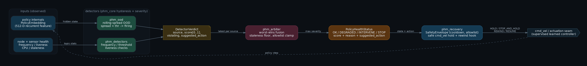

# Policy Health Monitor (PHM)

**A runtime watchdog for learned robot policies: it reads the policy's own internal
embeddings and raises `OK`, `DEGRADED`, `INTERVENE`, or `STOP` (each with a
human-readable reason and a recommended action) before the robot's behavior visibly
breaks.** It is for engineers running a learned controller on a robot who need a
supervisor that can hand control to a safe fallback in time.

## What problem this solves

A learned policy has no error code. When it drifts out of distribution it keeps
publishing confident, well-formed commands, and the first visible symptom is the robot
already doing the wrong thing. A watchdog on the policy's *output* only fires after that
point, and a watchdog on the input images misses the case where the scene looks normal
but the policy's internal state has quietly frozen.

PHM taps the hidden state instead. It tracks the trace of the rolling covariance of the
policy embedding, so a frozen or collapsed internal state shows up as a variance drop
even though the embedding never leaves the in-distribution region. Detector verdicts,
node health, and sensor health are then fused by a worst-wins arbiter into one health
signal, with hysteresis so a single noisy frame does not stop the robot.



## Concrete example

A healthy policy stream, then the same policy collapsing at frame 200. The threshold is
calibrated on the healthy phase only, at its 1st percentile:

```python
import numpy as np
from phm_sim import generate_embeddings
from phm_core.calibration import rolling_spread, calibrate_threshold

healthy, collapsed = generate_embeddings(dim=64, n_frames=200, seed=42)
threshold = calibrate_threshold(rolling_spread(healthy, window=20), percentile=1.0)

stream = np.vstack([healthy, collapsed])       # the policy collapses at frame 200
spread = rolling_spread(stream, window=20)
ood = spread < threshold
valid = ~np.isnan(spread)

print(f"calibrated threshold   {threshold:.2f}")
print(f"mean spread, healthy   {np.nanmean(spread[:200]):.2f}")
print(f"mean spread, collapsed {np.nanmean(spread[220:]):.2f}")
print(f"first alarm at/after collapse   frame {int(np.argmax(ood[200:])) + 200}")
print(f"false alarms on healthy frames  {int(ood[:200].sum())} / {int(valid[:200].sum())}")
```

```text
calibrated threshold   56.86
mean spread, healthy   61.87
mean spread, collapsed 0.01
first alarm at/after collapse   frame 200
false alarms on healthy frames  2 / 181
```

Two false alarms out of 181 healthy frames is what a 1st-percentile calibration is
supposed to produce; the hysteresis stage in `phm_core` exists to absorb exactly those.

## Status and verified numbers

| Item | Value |
|---|---|
| Pure-Python test suite | 295 passed (`pytest`, no ROS required) |
| ROS 2 graph | 8 packages, builds with `colcon` on Humble, install overlay passes an import smoke |
| Benchmark: collapse failure | PHM AUROC 1.000 (95% CI [1.000, 1.000]), FPR@95 0.000. Best baseline is KNN at AUROC 0.419; the rest are 0.03 to 0.12 |
| Benchmark: shift failure | PHM AUROC 1.000, and Mahalanobis, Relative Mahalanobis, unnormalized KNN and both RND forms also 1.000 |
| Detector cost | 11.6 us per frame, median of 30 repeats, numpy on CPU, fit and score amortised over the stream |
| Data used | synthetic policy streams only. No real-policy embeddings yet |
| Hardware validation | not done. On-device latency, false-positive rate on a real policy, and an induced-failure demo on a robot remain pending |
| Release | 0.1.0 |

## Packages

| Package | Role |
|---|---|
| `phm_msgs` | ROS 2 messages: `PolicyHealthStatus`, `PolicyEmbedding`, `DetectorVerdict`. |
| `phm_core` | Pure-Python detector logic (Detector ABC, Hysteresis, calibration, severity). No ROS dependency. |
| `phm_detectors` | Concrete detectors, including the rolling-spread / collapse detector. |
| `phm_ood` | OOD scoring on policy internals. |
| `phm_arbiter` | Worst-wins arbiter that fuses detector verdicts + node/sensor health into one `PolicyHealthStatus` (total ordering, stale-critical safety). |
| `phm_recovery` | Safe-fallback layer (`cmd_vel` hold + rewind hook). |
| `phm_ood_cpp` | C++ managed-lifecycle `rclcpp` runtime node with plain / Eigen / LibTorch backends. |
| `phm_sim` | Synthetic policy-stream harness for end-to-end tests. |

The full signal flow, including the recovery layer, is also available as a vector image
in [docs/architecture.svg](docs/architecture.svg).

## Benchmark

The PHM OOD detector is benchmarked against Mahalanobis, Relative Mahalanobis, KNN, and
RND (closed-form and torch-trained) on two synthetic failure families. Metrics are
threshold-free (AUROC, AUPR, FPR@95TPR) with stratified-bootstrap 95% CIs. Full numbers
and methodology in [benchmark/RESULTS.md](benchmark/RESULTS.md).

Headline: on the **collapse** failure (a frozen, low-variance embedding) the PHM
rolling-spread detector is perfect (AUROC 1.000, FPR@95 0.000) while every location-based
baseline is at or below chance (AUROC 0.03 to 0.42). A collapse is a second-order anomaly
(within-window variance drops while the embedding's location does not move), so first-order
location detectors are structurally blind to it. On the **shift** failure both the location
baselines and PHM are perfect. The two scenarios make the contrast explicit; PHM covers the
failure mode the standard baselines miss. Both scenarios are synthetic, so these numbers
bound the detector's structural coverage, not its accuracy on a real policy.

## Installation

The ROS-free detector library (detector logic, OOD scoring, arbitration, recovery, and the
synthetic stream generator) installs with pip and needs no ROS:

```bash
pip install git+https://github.com/yusufdxb/policy-health-monitor.git
```

```python
from phm_sim import generate_embeddings
from phm_core import rolling_spread
```

The full ROS 2 graph (the `rclpy` nodes and C++ runtime node) builds with colcon on a
sourced ROS 2 Humble environment:

```bash
git clone https://github.com/yusufdxb/policy-health-monitor.git
cd policy-health-monitor
source /opt/ros/humble/setup.bash
colcon build
source install/setup.bash
repo_dir=$PWD
cd "$(mktemp -d)"
python3 "$repo_dir/scripts/check_install_imports.py"
```

The install-import smoke verifies that `phm_core` and the rclpy wrapper modules are
visible from the ament index and import after the colcon overlay is sourced. It also
fails if `PYTHONPATH` or pre-import `sys.path` points directly at PHM source package
roots, which catches regressions back to manual source-tree path setup. It also asserts
that `phm_msgs` and `phm_ood_cpp` resolve through the ament index.

### Running the C++ detector

`phm_ood_cpp`'s `ood_node` is a managed lifecycle node, so it does not publish until it
has been configured and activated. Parameters are read once in `on_configure`:

```bash
ros2 run phm_ood_cpp ood_node --ros-args -p window:=30 -p threshold:=0.05
# in another shell:
ros2 lifecycle set /phm_ood_cpp configure
ros2 lifecycle set /phm_ood_cpp activate
```

Embedding frames that arrive while the node is not ACTIVE are dropped, and deactivating
clears the rolling window so a re-activation never blends pre- and post-activation state.

## Development

```bash
python3 -m venv .venv
.venv/bin/pip install numpy==1.26.4 pytest ruff
# pure-Python stack (no ROS graph, no rclpy):
PYTEST_DISABLE_PLUGIN_AUTOLOAD=1 .venv/bin/python -m pytest \
  src/phm_core src/phm_detectors src/phm_ood src/phm_arbiter src/phm_recovery src/phm_sim benchmark -q
```

`phm_core` and the detector/arbiter/recovery logic carry no ROS dependency, so their tests
run fast without `rclpy`. The ROS 2 nodes are thin wrappers and build with `colcon`. The
`PYTEST_DISABLE_PLUGIN_AUTOLOAD=1` flag avoids ROS's `launch_testing` pytest plugin when a
ROS distro is sourced in the same shell.

After a colcon build, run the install-space import guard:

```bash
source /opt/ros/humble/setup.bash
source install/setup.bash
repo_dir=$PWD
cd "$(mktemp -d)"
python3 "$repo_dir/scripts/check_install_imports.py"
```

## What is not verified yet

The numbers above come from synthetic policy streams and a CPU test run. Target-platform
validation with real-policy embeddings, on-device latency and false-positive rate, and an
induced-failure demo on a robot all remain pending. Nothing in this repository has been
run on hardware.

## License

MIT, see [LICENSE](LICENSE).
