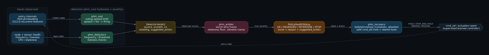
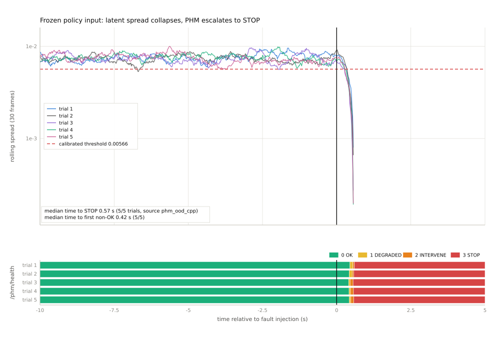
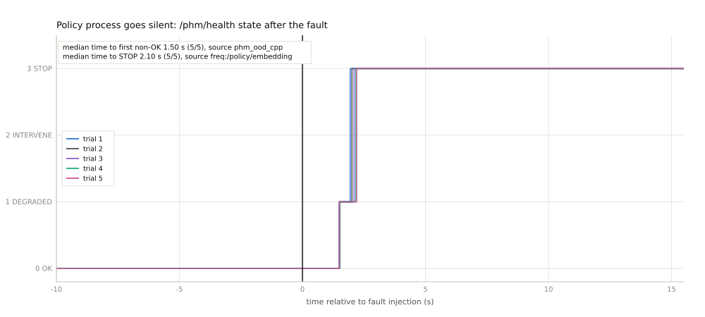
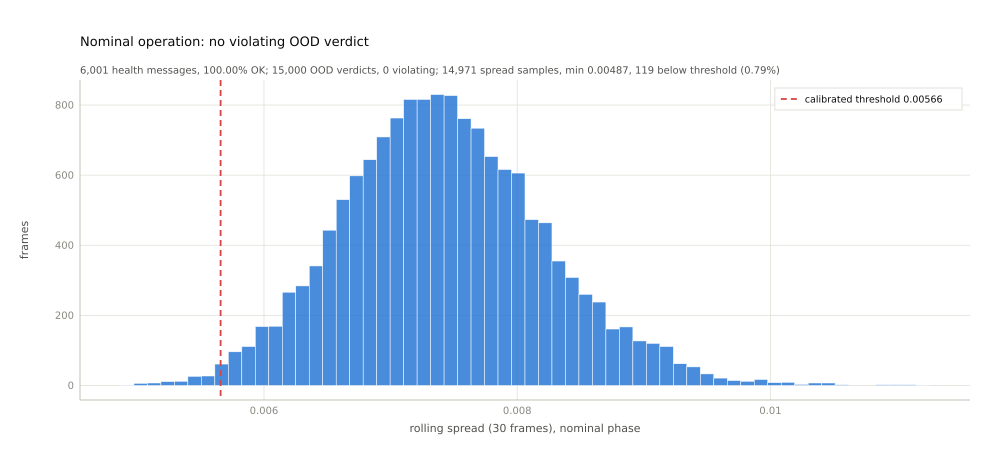

# Policy Health Monitor (PHM)

**A runtime watchdog for learned robot policies: it reads the policy's own internal
embeddings and raises `OK`, `DEGRADED`, `INTERVENE`, or `STOP` (each with a
human-readable reason and a recommended action) before the robot's behavior visibly
breaks.** It is for engineers running a learned controller on a robot who need a
supervisor that can hand control to a safe fallback in time.

## What problem this solves

A learned policy has no error code. When it drifts out of distribution it keeps
publishing confident, well-formed commands, and the first visible symptom is the robot
already doing the wrong thing. A watchdog on the policy's *output* only fires after that
point, and a watchdog on the input images misses the case where the scene looks normal
but the policy's internal state has quietly frozen.

PHM taps the hidden state instead. It tracks the trace of the rolling covariance of the
policy embedding, so a frozen or collapsed internal state shows up as a variance drop
even though the embedding never leaves the in-distribution region. Detector verdicts,
node health, and sensor health are then fused by a worst-wins arbiter into one health
signal, with hysteresis so a single noisy frame does not stop the robot.



## Concrete example

A healthy policy stream, then the same policy collapsing at frame 200. The threshold is
calibrated on the healthy phase only, at its 1st percentile:

```cpp
#include "phm_core/calibration.hpp"
#include "phm_core/sim.hpp"

auto batch = phm_core::generate_embeddings(/*dim=*/64, /*n_frames=*/200, 1.0, 0.01, /*seed=*/42);
double threshold = phm_core::calibrate_threshold(phm_core::rolling_spread(batch.in_dist, 20), 1.0);

auto stream = phm_core::vstack({&batch.in_dist, &batch.ood});  // collapses at frame 200
std::vector<double> spread = phm_core::rolling_spread(stream, 20);  // NaN until the window fills
// spread[t] < threshold flags frame t as out of distribution
```

The complete program is `src/phm_core/examples/collapse_example.cpp`
(`phm_collapse_example`, also run as a test), and it prints:

```text
calibrated threshold   56.86
mean spread, healthy   61.87
mean spread, collapsed 0.01
first alarm at/after collapse   frame 200
false alarms on healthy frames  2 / 181
```

Two false alarms out of 181 healthy frames is what a 1st-percentile calibration is
supposed to produce; the hysteresis stage in `phm_core` exists to absorb exactly those. The
synthetic stream is the one `numpy.random.default_rng(42)` produces, and the threshold
and spreads are bit-identical to the NumPy implementation this C++ replaced.

## On a real robot

PHM has run on the onboard computer of a Unitree GO2 (aarch64, ROS 2 Humble), with all
8 packages built there with `colcon`. The watched policy was the
[go2-phoenix](https://github.com/yusufdxb/go2-phoenix) stand-v3 locomotion policy in
shadow mode: it read the robot's live `/lowstate` at 50 Hz, computed actions that were
never sent, and published its 384-D hidden-layer latent for PHM to score. The robot stood
still under its own controller (Unitree sport mode, operator holding the remote). Two
failures were then induced in software, {{TRIALS}} trials each: `freeze_obs` feeds the
policy a stale observation snapshot, and `stop` makes the policy process go silent.



| Measured on the GO2 | Result |
|---|---|
| Nominal, no fault, {{NOM_SEC}} s | {{NOM_NON_OK}} non-OK of {{NOM_HEALTH_MSGS}} `/phm/health` messages; {{NOM_OOD_VIOLATING}} violating of {{NOM_OOD_VERDICTS}} OOD verdicts |
| `freeze_obs` fault | `STOP` in {{FREEZE_DETECTED}} trials; first violating OOD verdict at median {{FREEZE_VERDICT_MEDIAN_S}} s; `STOP` at median {{FREEZE_STOP_MEDIAN_S}} s, max {{FREEZE_STOP_MAX_S}} s |
| `stop` fault | `STOP` in {{STOP_DETECTED}} trials; first non-OK health at median {{STOP_FIRST_NONOK_MEDIAN_S}} s; `STOP` at median {{STOP_STOP_MEDIAN_S}} s, max {{STOP_STOP_MAX_S}} s |
| CPU in the nominal phase, % of one core | detectors {{CPU_DETECTORS}}, C++ OOD node {{CPU_OOD}}, arbiter {{CPU_ARBITER}}, shadow policy {{CPU_EMBEDDER}} |
| Rolling-spread step, C++ `bench_latency`, D=384, W=30, 5000 frames (the C++ OOD core before the 0.2.0 migration; not re-measured on the robot since) | plain backend p50 25.4 us, p99 26.5 us; Eigen backend p50 48.2 us, p99 53.9 us |
| Policy forward pass, onnxruntime Python API on CPU, 1 thread (the 0.2.0 shadow node uses the C++ API and has not run on the robot yet) | p50 0.135 ms |

Latencies run from the moment the fault is injected (the shadow policy's log timestamp)
to the moment a separate subscriber receives the PHM message, both on the robot's clock,
so they include delivery and detector compute. The threshold ({{THRESHOLD}}) is the 1st
percentile of the 30-frame rolling spread over {{CAL_FRAMES}} live latent frames recorded
at the start of the session. The C++ benchmark times the detector core only
(`OodCore::update`), not DDS or executor time.





**What this run does not show.** The robot stood still; it did not walk. The policy ran in
shadow mode and never controlled the robot, and nothing in the session published a
command (`phm_recovery` was not launched). The threshold was calibrated, and the
false-alarm rate measured, on that standing-still state only. Both faults were induced in
software. `freeze_obs` holds the whole observation constant, including the policy's own
last-action term, so the latent becomes exactly constant, which is the easiest case for
this detector. `stop` removes the embedding stream, so it exercises liveness checks rather
than the latent statistics. This is not a real policy failing in the field, and it is not
evidence that PHM warns before a behavioral failure. One gap is known and open: a
rolling-spread collapse detector calibrated on a still robot can confuse "the robot is
still" with "the policy collapsed" when the robot goes from moving to still.
{{STANDUP_OBSERVATION}}

**Bugs that only the robot found.** Running on the GO2 exposed three bugs the test suite
had missed, all fixed in commit `710b5d6`:

1. The arbiter crashed on the first live verdict. It set an attribute on the received
   message, and generated rclpy message classes use `__slots__`, so `/phm/health` had
   never been published on a real graph. The unit tests passed plain objects and could not
   see it. The arbiter is C++ now, and `phm_arbiter/test/test_arbiter_node.cpp` sends real
   `DetectorVerdict` messages over a live rclcpp graph and checks `/phm/health`.
2. The detectors node built its CPU, memory, and GPU-temperature checks but never fed
   them a reading.
3. The liveness and rate checks deserialized every message on the topics they watch,
   though they only need arrival times. Raw subscriptions cut the (then Python) detectors
   node from about 81% to 52% of one core with the 500 Hz `/lowstate` in the watched set.
   The C++ node keeps raw generic subscriptions.

How to reproduce the session, and exactly what publishes what, is in
[integrations/go2/README.md](integrations/go2/README.md).

## Status and verified numbers

| Item | Value |
|---|---|
| Test suites | colcon on Humble: 267 tests in 10 packages, 0 failures (gtest, including live rclcpp-graph tests of the detectors, OOD, arbiter and recovery nodes, plus ament lint). Standalone CMake, no ROS: 20 CTest entries (145 gtest cases and the README example), 0 failures |
| ROS 2 graph | 10 `ament_cmake` packages build with `colcon` on Humble; the install overlay passes `scripts/check_install_overlay.sh`. The 0.1.x Python tree built 8/8 on the GO2's onboard computer (aarch64); the C++ tree has not been built there yet |
| Benchmark: collapse failure | PHM AUROC 1.000 (95% CI [1.000, 1.000]), FPR@95 0.000. Best baseline is KNN at AUROC 0.419; the rest are 0.03 to 0.12 |
| Benchmark: shift failure | PHM AUROC 1.000, and Mahalanobis, Relative Mahalanobis, unnormalized KNN and both RND forms also 1.000 |
| Detector cost | Benchmark: 0.54 us per frame, fit and score amortised over the stream, median of 30 repeats (C++, [benchmark/RESULTS.md](benchmark/RESULTS.md)). Detector core per frame (`bench_latency`, D=384, W=30, plain backend, desktop x86-64): p50 3.9 to 4.0 us, p99 4.4 to 5.1 us over 3 runs; the pre-migration C++ core measured p50 7.4 us on the same machine. On the GO2's onboard computer the pre-migration core measured p50 25.4 us |
| End-to-end chain | Isolated localhost graph on a desktop x86-64 machine, synthetic 50 Hz embeddings, D=384, 500 Hz auxiliary topic, `scripts/measure_chain.sh`: embedding to OOD verdict p50 0.08 ms, p99 0.17 to 0.22 ms, 4850 of 4850 verdicts received (two runs); fault to `/phm/cmd_vel` zero velocity 0.48 to 0.49 s (mostly window refill and hysteresis); each C++ node 0.2% to 1.0% of one core and 24 to 28 MB RSS, against 1.7% to 6.4% and 58 to 63 MB for the Python nodes it replaced. Not measured on the robot |
| Data used | Benchmark: synthetic policy streams. On the robot: the 384-D latent of a trained GO2 locomotion policy in shadow mode on live `/lowstate`, robot standing still |
| Hardware validation | Partial. On a Unitree GO2 standing still under its own controller, with the policy in shadow mode: onboard build, CPU cost, false-alarm rate, and time to `STOP` for two software-induced faults ([On a real robot](#on-a-real-robot)). Not done: a walking robot, a policy in control, a real (not induced) failure, early warning before a behavioral failure |
| Release | 0.1.0. The C++ migration (0.2.0) is unreleased; see [CHANGELOG.md](CHANGELOG.md) |

## Packages

| Package | Role |
|---|---|
| `phm_msgs` | ROS 2 messages: `PolicyHealthStatus`, `PolicyEmbedding`, `DetectorVerdict`. |
| `phm_core` | ROS-independent C++ library: detector interface, hysteresis, severity bands, rolling-spread calibration, the OOD core (plain / Eigen / optional LibTorch kernels), health detectors, worst-wins arbitration, recovery logic, synthetic streams, NumPy-compatible random streams and `.npy` / `.npz` I/O. Builds with plain CMake as well as colcon. |
| `phm_tools` | Header-only offline helpers: JSON, SVG charts, and a small MLP trainer for the benchmark and demo. No ROS dependency. |
| `phm_detectors` | Topic-rate, dead-topic and host CPU / memory / GPU-temperature detectors; the node watches topics with raw generic subscriptions (arrival times only). |
| `phm_ood` | The OOD lifecycle node with the `phm_ood` interface (configurable topic, `.npz` calibration file, `embed_dim`, source `phm_ood`). |
| `phm_ood_cpp` | The OOD lifecycle node with the `phm_ood_cpp` interface (`ood_node`, source `phm_ood_cpp`), the lifecycle node library both interfaces share, and `bench_latency`. |
| `phm_arbiter` | Worst-wins arbiter that fuses detector verdicts + node/sensor health into one `PolicyHealthStatus` (total ordering, stale-critical safety). |
| `phm_recovery` | Safe-fallback layer (`cmd_vel` hold + rewind hook), actuation off unless `recovery.enabled` is true. |
| `phm_sim` | Synthetic policy-stream publisher for end-to-end tests, and `phm_chain_bench`, which times a running graph from embedding to verdict, health and recovery output. |
| `phm_go2` | [`integrations/go2/`](integrations/go2/README.md): runs PHM onboard a Unitree GO2 with a shadow-mode policy (ONNX Runtime C++) that publishes a real policy latent, a probe that calibrates PHM and records its output, a session runner that injects faults, and tools that reduce a session to numbers and figures. Nothing in it commands the robot. |

Every package is C++ (`ament_cmake`). The repository contains no project Python; ROS 2's
own tooling (`ros2 launch`, `ros2 lifecycle`, colcon, rosidl's generated message bindings)
is used as shipped.

The full signal flow, including the recovery layer, is also available as a vector image
in [docs/architecture.svg](docs/architecture.svg).

## Benchmark

The PHM OOD detector is benchmarked against Mahalanobis, Relative Mahalanobis, KNN, and
RND (closed-form and a gradient-trained MLP) on two synthetic failure families. Metrics are
threshold-free (AUROC, AUPR, FPR@95TPR) with stratified-bootstrap 95% CIs. Full numbers
and methodology in [benchmark/RESULTS.md](benchmark/RESULTS.md). The benchmark is C++
(`benchmark/`, binary `phm_benchmark`); its seeded streams and bootstrap resamples are the
ones the original NumPy harness drew, and every AUROC, AUPR, FPR@95 and CI bound matches
the NumPy / PyTorch harness it replaced at the printed precision
(`scripts/check_benchmark_reproduces.sh` re-checks this in CI).

Headline: on the **collapse** failure (a frozen, low-variance embedding) the PHM
rolling-spread detector is perfect (AUROC 1.000, FPR@95 0.000) while every location-based
baseline is at or below chance (AUROC 0.03 to 0.42). A collapse is a second-order anomaly
(within-window variance drops while the embedding's location does not move), so first-order
location detectors are structurally blind to it. On the **shift** failure both the location
baselines and PHM are perfect. The two scenarios make the contrast explicit; PHM covers the
failure mode the standard baselines miss. Both scenarios are synthetic, so these numbers
bound the detector's structural coverage, not its accuracy on a real policy.

## Installation

### ROS-independent library and tools (CMake)

`phm_core` (with `phm_tools`, the benchmark, the demo and the GO2 session tools) builds
without ROS. Requirements: a C++17 compiler, CMake 3.16 or newer, zlib, Eigen 3 and
GoogleTest (`sudo apt install cmake g++ zlib1g-dev libeigen3-dev libgtest-dev`).

```bash
git clone https://github.com/yusufdxb/policy-health-monitor.git
cd policy-health-monitor
cmake -S standalone -B build/standalone -DCMAKE_BUILD_TYPE=Release
cmake --build build/standalone -j
ctest --test-dir build/standalone --output-on-failure
```

To use the library from another CMake project, install it and use `find_package`:

```bash
cmake -S src/phm_core -B build/phm_core -DCMAKE_BUILD_TYPE=Release
cmake --build build/phm_core -j
cmake --install build/phm_core --prefix /opt/phm
```

```cmake
find_package(phm_core REQUIRED)        # CMAKE_PREFIX_PATH=/opt/phm
target_link_libraries(my_target phm_core::phm_core)
```

### ROS 2 graph (colcon)

On a sourced ROS 2 Humble environment:

```bash
source /opt/ros/humble/setup.bash
rosdep install --from-paths src integrations --ignore-src -y --rosdistro humble
colcon build --cmake-args -DCMAKE_BUILD_TYPE=Release
source install/setup.bash
scripts/check_install_overlay.sh
```

The overlay check resolves every package through the ament index, checks that every
executable is installed with all its shared libraries resolvable, that the launch files
and configs are installed, that no project Python was installed, and that a CMake
consumer of `phm_core` builds and runs. The GO2 shadow-policy node is built only when
ONNX Runtime (`-DONNXRUNTIME_ROOT=...`) and Unitree's `unitree_go` messages are found; see
[integrations/go2/README.md](integrations/go2/README.md).

Each node package ships an XML launch file:

```bash
ros2 launch phm_detectors detectors.launch.xml
ros2 launch phm_arbiter arbiter.launch.xml staleness_sec:=2.0
ros2 launch phm_ood phm_ood.launch.xml threshold:=0.019 window:=30
ros2 launch phm_recovery recovery.launch.xml    # recovery.enabled: false by default
ros2 launch phm_sim sim.launch.xml
```

### Running the OOD detector

`ood_node` (package `phm_ood_cpp`) and `phm_ood_node` (package `phm_ood`) are managed
lifecycle nodes, so they do not publish until configured and activated. Parameters are
read once in `on_configure`:

```bash
ros2 run phm_ood_cpp ood_node --ros-args -p window:=30 -p threshold:=0.05
# in another shell:
ros2 lifecycle set /phm_ood_cpp configure
ros2 lifecycle set /phm_ood_cpp activate
```

Embedding frames that arrive while the node is not ACTIVE are not scored. Deactivating
`ood_node` clears the rolling window so a re-activation never blends pre- and
post-activation state; `phm_ood_node` keeps its window until cleanup, as it always did.
The spread kernel is selected with `PHM_BACKEND=plain|eigen|libtorch`; unset, the node
prefers Eigen when it was built. On both the GO2 and a desktop x86-64 machine the plain
kernel measured faster, and it reproduces NumPy's arithmetic exactly, so
`PHM_BACKEND=plain` is the recommended setting.

### Non-finite inputs

The OOD detector never scores a window whose rolling spread is NaN or Inf as in
distribution. Because `NaN < threshold` evaluates false, a naive threshold comparison would
pass exactly the input a broken upstream policy emits. The shared C++ detector core tests
the spread for finiteness first and returns a verdict with score 0.5 (`BAD_INPUT_SCORE`,
the intervene boundary), no suggested action, and the reason
`non-finite spread: embedding contains NaN or Inf`. The verdict is marked non-violating,
since a non-finite embedding is a detector-health fault rather than evidence of OOD, and it
is cached so the frequency gate carries it forward instead of replaying the last good
verdict. `phm_core/test/test_ood_core.cpp` covers it.

Limit: the arbiter does not escalate a fresh non-violating verdict (a fixed rule since
0.1.0), so this verdict is visible on `/phm/verdicts` but leaves `/phm/health` at `OK`. The
same holds for the dimension-mismatch and oversized-embedding verdicts. A consumer that
needs to act on bad input must watch `/phm/verdicts` for these reasons. Raising bad-input
verdicts to a health degradation is an open design decision, not current behavior.

## Development

```bash
# ROS-free build and tests
cmake -S standalone -B build/standalone -DCMAKE_BUILD_TYPE=Release
cmake --build build/standalone -j && ctest --test-dir build/standalone --output-on-failure

# ROS 2 packages: gtest on live rclcpp graphs, cpplint, xmllint
source /opt/ros/humble/setup.bash
colcon build --cmake-args -DCMAKE_BUILD_TYPE=Release
colcon test && colcon test-result --verbose

# Repository checks (also run in CI)
scripts/check_public_hygiene.sh
scripts/check_no_project_python.sh
scripts/check_benchmark_reproduces.sh build/standalone/benchmark/phm_benchmark

# End-to-end timing of the running chain on this machine (isolated, synthetic input)
source install/setup.bash && scripts/measure_chain.sh /tmp/phm_chain
```

The decision logic was ported from a Python implementation and checked against it before
that implementation was removed: the OOD core, health detectors, arbiter and recovery
logic produced identical verdicts, states, scores and reason strings on randomized
scenarios, and the random streams, rolling spread and calibration reproduce NumPy
bit for bit. The tests pin those behaviors with fixtures.

## What is not verified yet

The benchmark numbers come from synthetic policy streams. The on-robot numbers come from
one GO2 standing still under its own controller, with the policy in shadow mode and two
software-induced faults. Not yet verified:

- a walking robot, and a policy that actually controls the robot
- a real policy failure, rather than an induced one
- whether PHM warns before a behavioral failure
- the moving-to-still transition, where a collapse detector calibrated on a still robot
  may read a robot that has stopped moving as a collapsed policy
- the recovery layer (`phm_recovery`) on hardware; it was never launched on the robot
- the C++ nodes on the robot: the GO2 numbers above were recorded with the 0.1.x Python
  nodes, the original C++ OOD node and the Python shadow policy. The 0.2.0 C++ tree,
  including the ONNX Runtime C++ shadow node, has not been built or run on the robot's
  onboard computer (aarch64); its parity evidence comes from replay on a desktop machine
- a second robot

## License

MIT, see [LICENSE](LICENSE).
