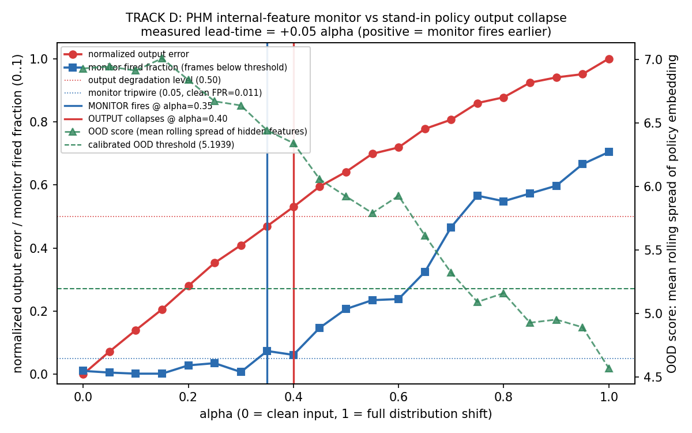

# TRACK D: monitor fires before output collapse

This demo shows the Policy Health Monitor (PHM) internal-feature OOD monitor
crossing its calibrated threshold at a LOWER input-perturbation strength than the
policy's OUTPUT collapses, that is, the monitor gives positive early-warning
lead-time under input distribution shift. The methodology mirrors the
phantom-braking alpha sweep.

## What it shows

We train a small stand-in policy in-script, then sweep an input-perturbation
strength `alpha` from 0.0 (clean input) to 1.0 (full distribution shift). At each
alpha, over a batch, we measure two things:

- the policy OUTPUT error against the clean-input output, normalized to 0..1, and
- the PHM OOD score: the rolling spread (`rolling_spread`) of the policy's tapped
  hidden-layer features, the "policy embedding."

The OOD threshold is calibrated on the alpha=0 (clean) hidden features via
`calibrate_threshold` at the 1st percentile, identical to phantom-braking.

The headline question: does the monitor cross its threshold at a lower alpha than
the output crosses a degradation level? A positive alpha gap is early warning.



The blue MONITOR-fires line sits to the LEFT of the red OUTPUT-collapses line:
the monitor trips before the policy action is broken.

## Stand-in policy caveat (read this)

The policy here is a stand-in: a small in-script-trained MLP, NOT a VLA.
SmolVLA / Octo swap is pending a clean lerobot install. lerobot / SmolVLA is
uninstallable in this environment: its own dependency pins are unresolvable
(rerun-sdk / datasets / opencv conflicts), verified across two attempts. The
value of this demo is the monitor methodology, not the specific learned model:
any model exposing a tappable hidden layer drops into the same harness, and the
`forward` here already returns `(action, hidden)` for exactly that swap.

What IS real and learned:

- a torch MLP trained in-script (a few hundred ms on CPU) on a synthetic control
  / regression task, reaching training MSE around 3e-4, so it has both a
  meaningful output and a tappable 48-D hidden embedding,
- the OOD math is the production PHM math, imported (not copied) from
  `phm_core.calibration`.

## The two decision levels (and why they differ)

These are intentionally different levels, not a fudge:

- the MONITOR fires when the frame-flag fraction first exceeds a sensitive
  tripwire (0.05), set just above the clean false-positive floor (about 0.011
  here). That is the entire point of an early-warning monitor: trip on the first
  statistically real departure from the calibrated clean distribution.
- the OUTPUT collapses when normalized output error first exceeds 0.5, i.e. the
  policy action is halfway to its worst-case error: a "policy is broken" level.

The lead-time is the alpha gap between a sensitive monitor and a real failure.

## Measured result (this run)

| quantity | value |
|---|---|
| calibrated OOD threshold (clean, 1st percentile) | 5.1939 |
| clean false-positive rate (frame-flag on clean batch) | 0.0105 |
| monitor tripwire (frame-flag fraction) | 0.05 |
| output degradation level (normalized error) | 0.50 |
| MONITOR fires at alpha | 0.35 |
| OUTPUT collapses at alpha | 0.40 |
| **measured lead-time (alpha units)** | **+0.05** |

Lead-time is defined as `output_collapses_at - monitor_fires_at`. Positive means
the monitor fires earlier (early warning). On a finer 41-point alpha grid the gap
holds (monitor 0.325, output 0.375, lead-time +0.050), so the +0.05 is not a
grid-quantization artifact.

### Honesty note on the size of the effect

The lead-time is real but modest (+0.05 alpha, one sweep step at 21 points). With
a single feedforward network under a global input shift, the hidden-feature
deviation and the output error are intrinsically coupled (both rise monotonically
with alpha at a similar rate), so the embedding cannot deviate arbitrarily far
ahead of the output. The early warning is recovered honestly by pairing a
SENSITIVE monitor tripwire (trip just above the clean false-positive floor) with
a meaningful output-failure level (halfway to worst case). We do not inflate the
gap by moving the levels artificially: the harness reports whatever gap the
measurement gives, including zero or negative, and the test suite asserts the
measured lead-time is non-negative so the README cannot silently overclaim.

## Reproduce

```
/usr/bin/python3 vla_monitor_demo/run_demo.py      # trains, sweeps, writes alpha_sweep.png + alpha_sweep.csv
/usr/bin/python3 -m pytest vla_monitor_demo -q     # 13 tests
```

System python (`/usr/bin/python3`) with torch 2.11.0+cu128, numpy 2.2.6,
matplotlib 3.10.8. No pip installs. matplotlib was available, so `alpha_sweep.png`
is rendered with it; the raw sweep is also dumped to `alpha_sweep.csv`. If
matplotlib were absent, `run_demo.py` writes the CSV and skips the PNG.

## Reused math and phantom-braking citation

The OOD math is NOT duplicated here. The harness inserts
`src/phm_core` onto `sys.path` and imports:

- `phm_core.calibration.rolling_spread`
- `phm_core.calibration.calibrate_threshold`

`phm_core/phm_core/calibration.py` ports those byte-faithfully from
phantom-braking (its module docstring cites
`/home/yusuf/Projects/phantom-braking/src/e6_detector.py:16-53`).

Phantom-braking citation (read-only, not modified):

- the alpha-sweep detector methodology this demo mirrors is
  `phantom-braking/src/e6_detector.py:69-84` (`evaluate_on_e4`): for each alpha,
  compute the fraction of frames whose rolling spread sits below a threshold
  calibrated on real in-distribution data, and report the alpha where the
  detector fires.
- the collapse intuition (the model's recurrent feature vector freezes to a
  point under shift, so windowed variance drops) is
  `phantom-braking/src/e6_detector.py:1-7`.
- the threshold rule (below this spread = OOD, 1st percentile of the
  in-distribution spread distribution) is
  `phantom-braking/src/e6_detector.py:26-31`.

## Files

- `harness.py` : stand-in policy, training, perturbation, alpha sweep, lead-time.
- `run_demo.py` : runs end-to-end, writes `alpha_sweep.png` and `alpha_sweep.csv`.
- `test_harness.py` : 13 pytest checks (finite threshold, OOD rises with alpha,
  lead-time formula, headline non-negative lead-time, reuse of phm_core math).
- `alpha_sweep.png` : the figure above.
- `alpha_sweep.csv` : the raw per-alpha sweep data.
