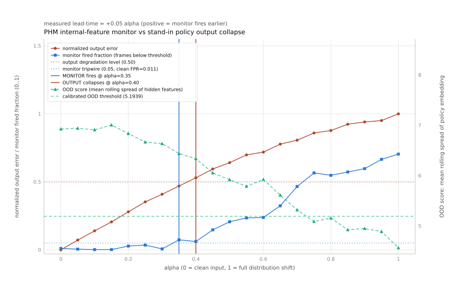

# TRACK D: monitor fires before output collapse

This demo shows the Policy Health Monitor (PHM) internal-feature OOD monitor
crossing its calibrated threshold at a LOWER input-perturbation strength than the
policy's OUTPUT collapses, that is, the monitor gives positive early-warning
lead-time under input distribution shift. The methodology mirrors the
supercombo-blindspot alpha sweep.

## What it shows

We train a small stand-in policy in-process, then sweep an input-perturbation
strength `alpha` from 0.0 (clean input) to 1.0 (full distribution shift). At each
alpha, over a batch, we measure two things:

- the policy OUTPUT error against the clean-input output, normalized to 0..1, and
- the PHM OOD score: the rolling spread (`phm_core::rolling_spread`)
  of the policy's tapped hidden-layer features, the "policy embedding."

The OOD threshold is calibrated on the alpha=0 (clean) hidden features via
`phm_core::calibrate_threshold` at the 1st percentile, identical to
supercombo-blindspot.

The headline question: does the monitor cross its threshold at a lower alpha than
the output crosses a degradation level? A positive alpha gap is early warning.



The blue MONITOR-fires line sits to the LEFT of the red OUTPUT-collapses line:
the monitor trips before the policy action is broken.

## Stand-in policy caveat (read this)

The policy here is a stand-in: a small MLP trained in-process, NOT a VLA.
SmolVLA / Octo swap is pending a clean lerobot install. lerobot / SmolVLA is
uninstallable in this environment: its own dependency pins are unresolvable
(rerun-sdk / datasets / opencv conflicts), verified across two attempts. The
value of this demo is the monitor methodology, not the specific learned model:
any model exposing a tappable hidden layer drops into the same harness, and the
policy's `forward` already returns `(action, hidden)` for exactly that swap.

What IS real and learned:

- a 16 -> 48 -> 48 -> 2 tanh MLP trained in-process (350 full-batch Adam steps on
  CPU) on a synthetic control / regression task, reaching training MSE around
  3e-4, so it has both a meaningful output and a tappable 48-D hidden embedding,
- the OOD math is the production PHM math: the demo links `phm_core` and calls
  its `rolling_spread` and `calibrate_threshold` (not a copy).

## The two decision levels (and why they differ)

These are intentionally different levels, not a fudge:

- the MONITOR fires when the frame-flag fraction first exceeds a sensitive
  tripwire (0.05), set just above the clean false-positive floor (about 0.011
  here). That is the entire point of an early-warning monitor: trip on the first
  statistically real departure from the calibrated clean distribution.
- the OUTPUT collapses when normalized output error first exceeds 0.5, i.e. the
  policy action is halfway to its worst-case error: a "policy is broken" level.

The lead-time is the alpha gap between a sensitive monitor and a real failure.

## Measured result (this run)

| quantity | value |
|---|---|
| calibrated OOD threshold (clean, 1st percentile) | 5.1939 |
| clean false-positive rate (frame-flag on clean batch) | 0.0105 |
| monitor tripwire (frame-flag fraction) | 0.05 |
| output degradation level (normalized error) | 0.50 |
| MONITOR fires at alpha | 0.35 |
| OUTPUT collapses at alpha | 0.40 |
| **measured lead-time (alpha units)** | **+0.05** |

Lead-time is defined as `output_collapses_at - monitor_fires_at`. Positive means
the monitor fires earlier (early warning). On a finer 41-point alpha grid the
sign holds but the gap halves: the monitor fires at 0.350 and the output
collapses at 0.375, a lead-time of +0.025. The +0.05 is therefore one step of
the 21-point grid, not a precise measurement of the lead. (An earlier version of
this README quoted 0.325 / 0.375 / +0.050 for the 41-point grid; neither this
implementation nor the Python one it replaces reproduces that: both give
0.350 / 0.375 / +0.025.)

### Honesty note on the size of the effect

The lead-time is real but modest (+0.05 alpha, one sweep step at 21 points, and
+0.025 at 41 points). With a single feedforward network under a global input
shift, the hidden-feature deviation and the output error are intrinsically
coupled (both rise monotonically with alpha at a similar rate), so the embedding
cannot deviate arbitrarily far ahead of the output. The early warning is
recovered honestly by pairing a SENSITIVE monitor tripwire (trip just above the
clean false-positive floor) with a meaningful output-failure level (halfway to
worst case). We do not inflate the gap by moving the levels artificially: the
harness reports whatever gap the measurement gives, including zero or negative,
and the test suite asserts the measured lead-time is non-negative so the README
cannot silently overclaim.

## Reproduce

The demo builds with the ROS-free superbuild (it needs Eigen 3 and, for the
tests, GoogleTest):

```bash
cmake -S standalone -B build/standalone -DCMAKE_BUILD_TYPE=Release
cmake --build build/standalone -j
build/standalone/vla_monitor_demo/vla_monitor_demo --out-dir vla_monitor_demo
ctest --test-dir build/standalone -R vla_monitor_demo --output-on-failure   # 7 tests
```

`vla_monitor_demo` trains, sweeps, prints the result above, and writes
`alpha_sweep.svg` and `alpha_sweep.csv` to `--out-dir` (default: the current
directory). It is deterministic: every run gives the same files. On a desktop
x86-64 machine one run took 1.4 s wall time and 16.6 MB peak RSS.

## Port from Python

The demo was a Python / PyTorch script until 0.2.0. The C++ port reproduces its
random streams exactly (PyTorch's `torch.manual_seed(0)` initialization of the
MLP and NumPy `default_rng` draws for the data and perturbations) and runs the
same Adam training in float32. Training arithmetic is not bit-identical to
PyTorch's kernels, so the trained weights differ in the last bits. Measured
against the Python version on the same machine:

- every decision is identical on both the 21- and 41-point grids: monitor and
  output crossing alphas, lead-time, clean false-positive rate (0.010508);
- in `alpha_sweep.csv`, the `alpha`, `normalized_output_error` and
  `monitor_fired_fraction` columns are identical, and
  `ood_score_mean_rolling_spread` differs by 1e-6 in the sixth decimal on 20 of
  21 rows;
- the calibrated threshold differs by 2.1e-7 relative (5.1939233 vs 5.1939222).

The figure is SVG instead of PNG.

## Reused math and supercombo-blindspot citation

The OOD math is NOT duplicated here. The harness links `phm_core` and calls (declared in
`phm_core/calibration.hpp`):

- `phm_core::rolling_spread`
- `phm_core::calibrate_threshold`

`phm_core` reproduces NumPy's evaluation order for those functions, which were
ported byte-faithfully from the public supercombo-blindspot `src/e6_detector.py`
implementation; its tests pin them to values NumPy produced.

supercombo-blindspot citation (read-only, not modified):

- the alpha-sweep detector methodology this demo mirrors is
  `supercombo-blindspot/src/e6_detector.py:69-84` (`evaluate_on_e4`): for each alpha,
  compute the fraction of frames whose rolling spread sits below a threshold
  calibrated on real in-distribution data, and report the alpha where the
  detector fires.
- the collapse intuition (the model's recurrent feature vector freezes to a
  point under shift, so windowed variance drops) is
  `supercombo-blindspot/src/e6_detector.py:1-7`.
- the threshold rule (below this spread = OOD, 1st percentile of the
  in-distribution spread distribution) is
  `supercombo-blindspot/src/e6_detector.py:26-31`.

## Files

- `include/vla_demo/harness.hpp`, `src/harness.cpp`: stand-in policy, training,
  perturbation, alpha sweep, lead-time.
- `src/run_demo.cpp`: runs end-to-end, writes `alpha_sweep.svg` and
  `alpha_sweep.csv`.
- `test/test_harness.cpp`: 7 GoogleTest checks (policy learns and exposes its
  hidden layer, finite threshold and small clean FPR, OOD signal rises with
  alpha, lead-time formula, headline non-negative lead-time, perturbation
  identity at alpha 0, zero spread for a frozen hidden state).
- `CMakeLists.txt`: builds the demo against `phm_core` and `phm_tools`.
- `alpha_sweep.svg`: the figure above.
- `alpha_sweep.csv`: the raw per-alpha sweep data.
